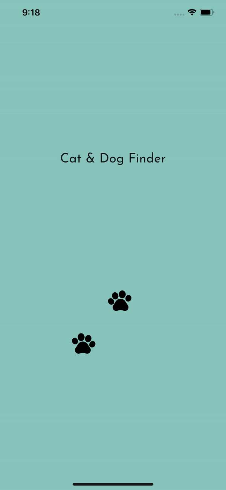
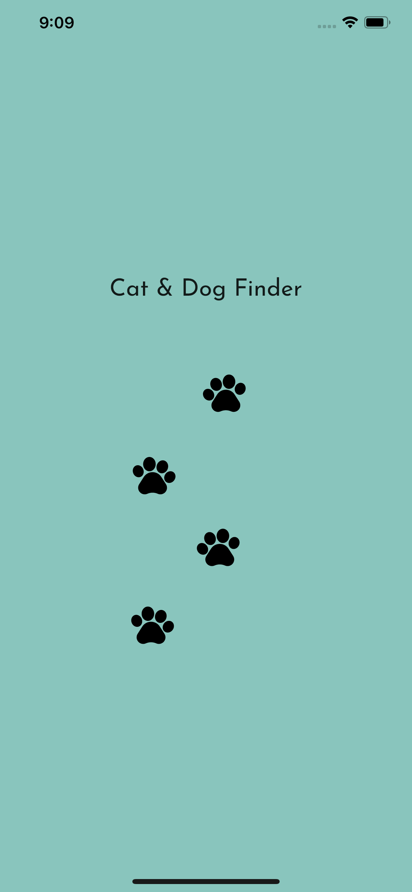
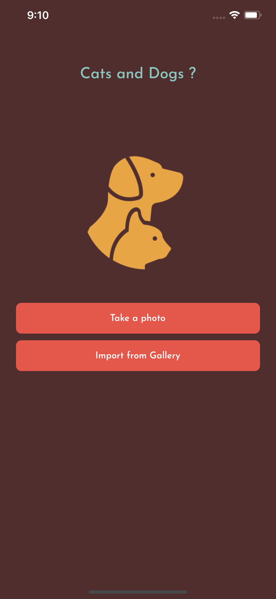
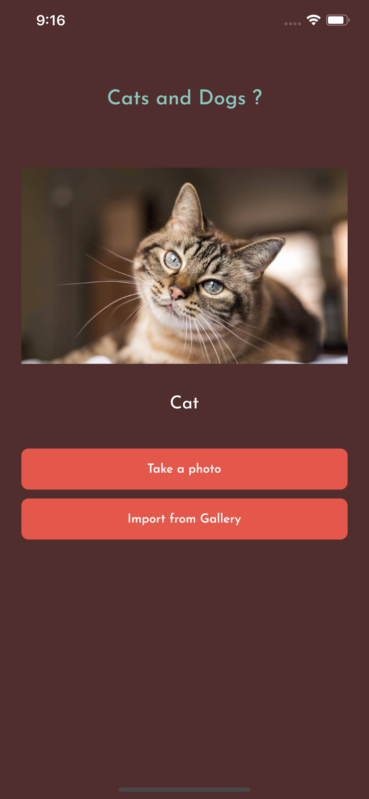
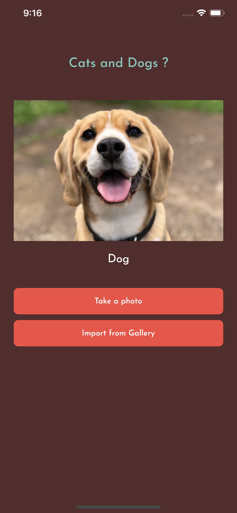

# Cat or Dog

I am studying Flutter and I created this application for learning. There is still room for improvement, so I am open to any feedback. Sharing with each other helps us grow and learn. ✌️

## about project

  

  
  
  

Project used for studies, it used tflite to recognize images, cat or dog

## Plugins used

- [tflite](https://pub.dev/packages/tflite):
- [image_picker](https://pub.dev/packages/image_picker): ^0.6.7+11
- [flutter_launcher_icons](https://pub.dev/packages/flutter_launcher_icons): ^0.8.1
- [lottie](https://pub.dev/packages/lottie): ^0.6.0
